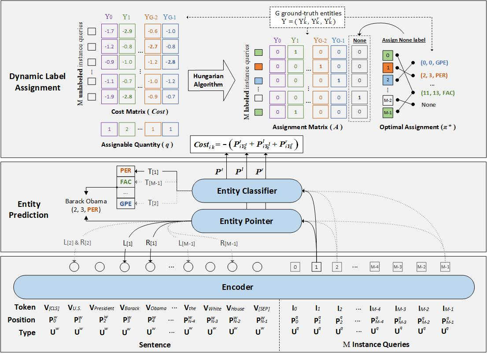

# README

Code for Two-stage Identifier: "**Parallel Instance Query Network for Named Entity Recognition**", accepted at ACL 2022. For details of the model and experiments, please see our paper.



## Setup

### Requirements

```bash
conda create --name acl python=3.8
conda activate acl
pip install -r requirements.txt
```
### Datasets

Nestedt NER:

+ ACE04: https://catalog.ldc.upenn.edu/LDC2005T09
+ ACE05: https://catalog.ldc.upenn.edu/LDC2006T06
+ KBP17: https://catalog.ldc.upenn.edu/LDC2017D55
+ GENIA: http://www.geniaproject.org/genia-corpus
+ NNE: https://github.com/nickyringland/nested_named_entities

Flat NER:

+ OntoNotes: https://github.com/yhcc/OntoNotes-5.0-NER
+ CoNLL03: https://data.deepai.org/conll2003.zip
+ FewNERD: https://ningding97.github.io/fewnerd/
+ MSRA: https://github.com/ShannonAI/mrc-for-flat-nested-ner/blob/master/ner2mrc/download.md


Data format:
```json
{
    "tokens": ["Others", ",", "though", ",", "are", "novices", "."], 
    "entities": [{"type": "PER", "start": 0, "end": 1}, {"type": "PER", "start": 5, "end": 6}], "relations": [], "org_id": "CNN_IP_20030328.1600.07", 
    "ltokens": ["WOODRUFF", "We", "know", "that", "some", "of", "the", "American", "troops", "now", "fighting", "in", "Iraq", "are", "longtime", "veterans", "of", "warfare", ",", "probably", "not", "most", ",", "but", "some", ".", "Their", "military", "service", "goes", "back", "to", "the", "Vietnam", "era", "."], 
    "rtokens": ["So", "what", "is", "it", "like", "for", "them", "to", "face", "combat", "far", "from", "home", "?", "For", "an", "idea", ",", "here", "is", "CNN", "'s", "Candy", "Crowley", "with", "some", "war", "stories", "."]
}
```

The `ltokens` contains the tokens from the previous sentence. And The `rtokens` contains the tokens from the next sentence.

Due to the license, we cannot directly release our preprocessed datasets of ACE04, ACE05, KBP17, NNE and Ontonotes. We only release the preprocessed GENIA, FewNERD, MSRA and CoNLL03 datasets. Download them from [here](https://drive.google.com/drive/folders/1UttZVSL9iAqxsfPfMfSAl9FYc4DytfP5?usp=sharing). 

If you need other datasets, please contact me (`syl@zju.edu.cn`) by email. Note that you need to state your identity and prove that you have obtained the license.

## Under construction


## Citation
If you have any questions related to the code or the paper, feel free to email `syl@zju.edu.cn`.

```bibtex
@inproceedings{shen-etal-2022-piqn,
    title = "Parallel Instance Query Network for Named Entity Recognition",
    author = "Shen, Yongliang  and
      Wang, Xiaobin  and
      Tan, Zeqi  and
      Xu, Guangwei  and
      Xie, Pengjun  and
      Huang, Fei and
      Lu, Weiming and
      Zhuang, Yueting",
    booktitle = "Proceedings of the 60th Annual Meeting of the Association for Computational Linguistics",
    year = "2022",
    publisher = "Association for Computational Linguistics",
    url = "",
}
```